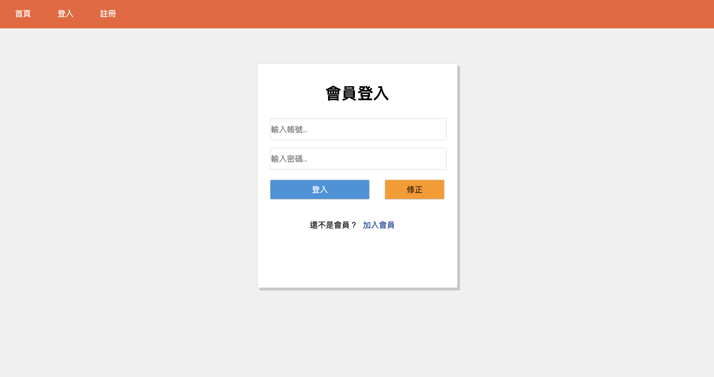
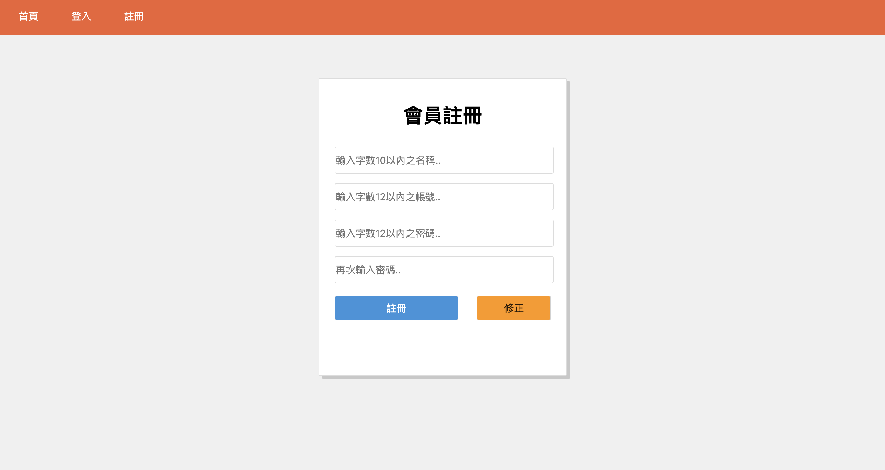
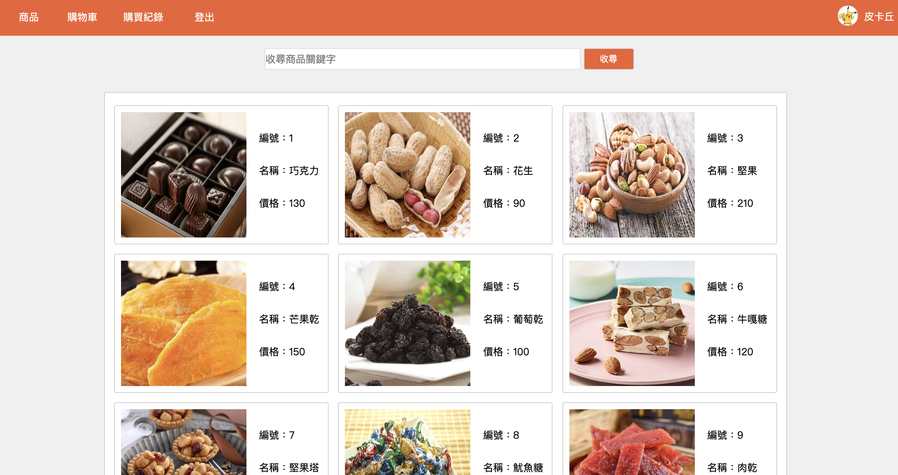
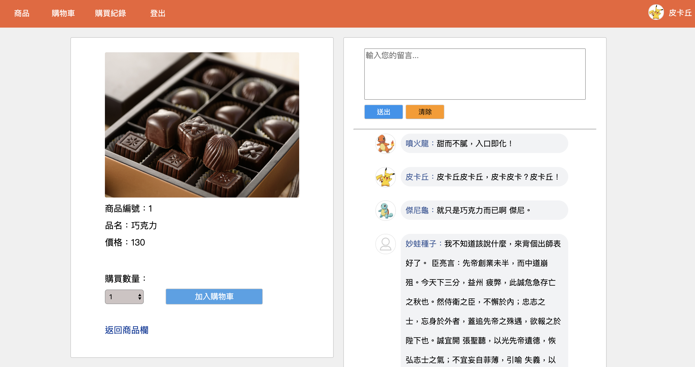
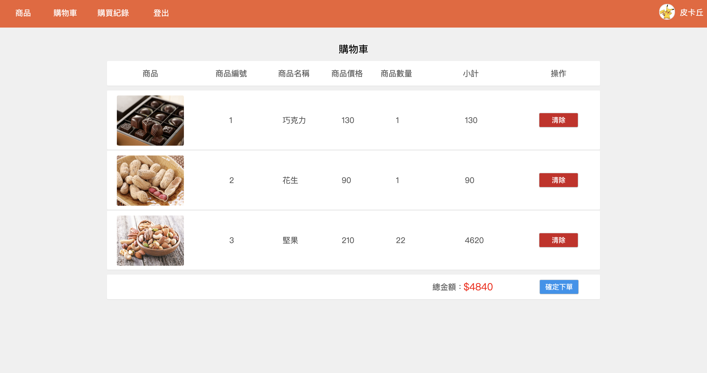
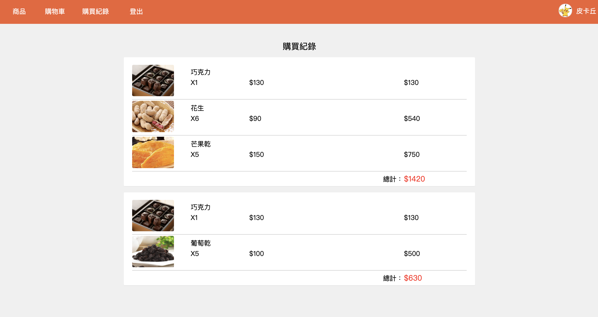
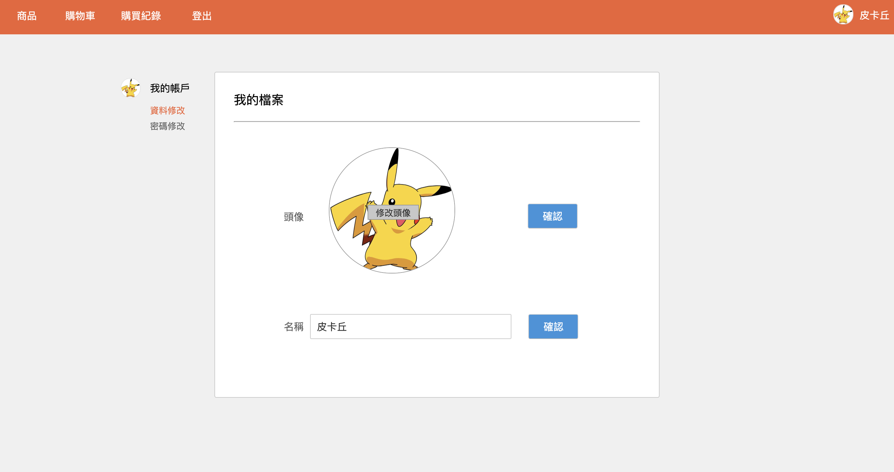
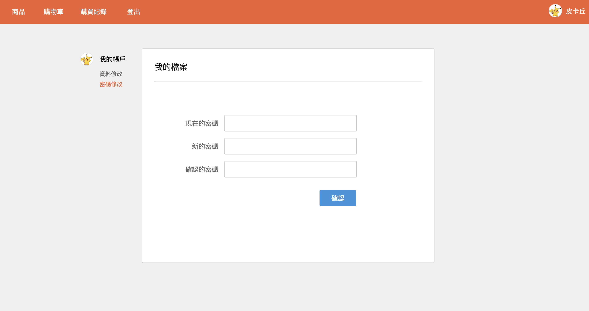
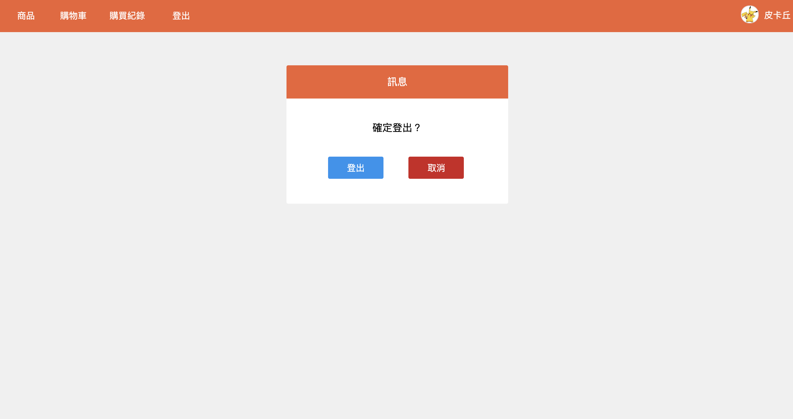

###############################
利用codeigniter框架練習製作購物網站
###############################

===================
登入頁面
===================

使用者登入頁面，各欄位設有JS alert判斷及PHP後端邏輯判斷

===================
註冊頁面
===================

供使用者註冊帳號，各欄位設有JS alert判斷及PHP後端邏輯判斷

===================
商品首頁
===================

供商品瀏覽及商品關鍵字查詢

===================
商品內容
===================

加入商品至購物車及評論商品

===================
購物車
===================

針對購物車裡商品進行確認、移除及下單

===================
購買紀錄
===================

可瀏覽已下單之歷史紀錄

===================
個人頁
===================

可編輯個人頭像及更改名稱

===================
密碼修改
===================

可更改帳戶密碼

===================
登出頁
===================

將使用者SESSION資料進行unset

